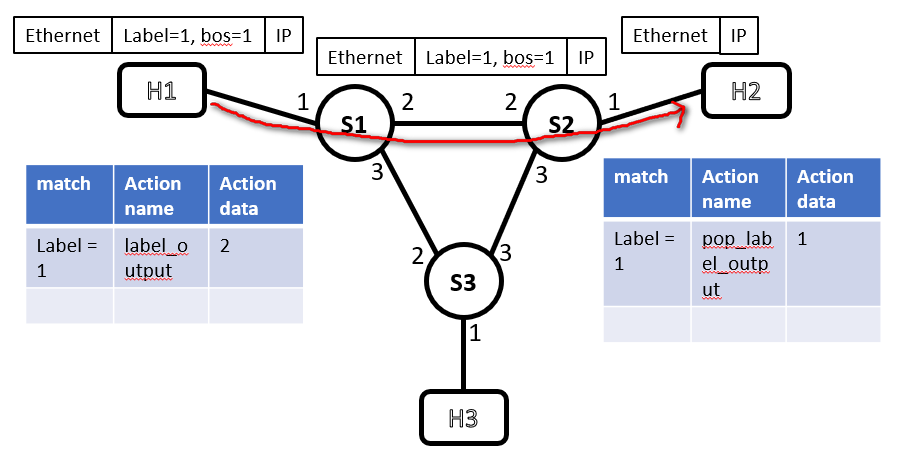
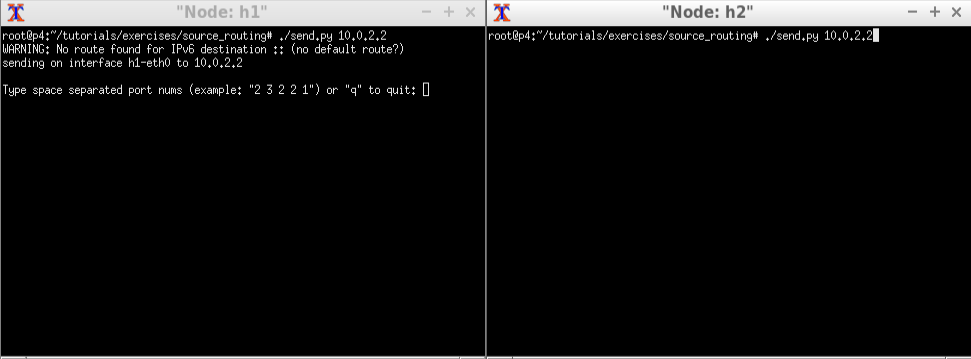
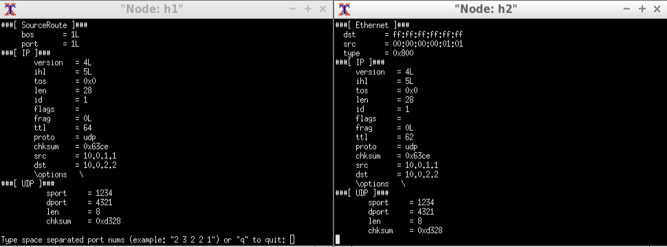
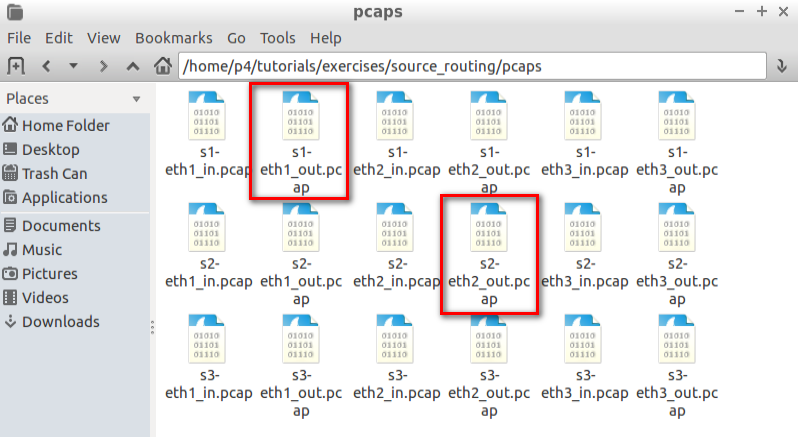
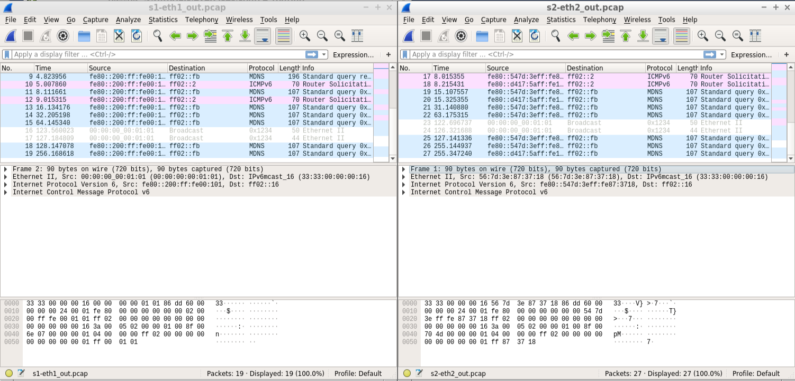

# P4_Source_routing

|Author|Chieh-Ting Chung|
|---|---
|E-mail|sksksk1748@gmail.com

## Memo

* P4 , Source_routing 

## Topic
* h1 的 packet 要送到 h2。但特別之處在於，Ethernet header 跟 IP header 中間加入了自己設計的 header,使用這個 header 與自己設計的 rule,
使 packet 能按照特殊 header 裡的 label(port) 決定 packet 傳送路線。
    * 

## Algorithm
1. Use the `port` field in header `srcRoute_t` as a label for label routing
2. Modify the parser
3. Define to actions
    * `label_output` : match the label and forward the packet to the port
    * `pop_label_output` : remove header `srcRoute_t` and output to the port
4. Create a table for label routing (`s1-runtime.json`, `s2-runtime.json`)
5. Modify rules to forward the label “1” to h2

## Requirements
* I assume `Oracle VM VirtualBox`. You have to install
    * [P4 VM image Download](https://drive.google.com/uc?id=1lYF4NgFkYoRqtskdGTMxy3sXUV0jkMxo&export=download)
* Copy the latest exercise
    ```bash
    $ git clone https://github.com/p4lang/tutorials
    ```

## Your `~/source_routing/` folder should look like this
```
source_routing
├── build/
│   └── ...
├── logs/  #compile完才會產生
│   └── ...
├── pcaps/ #compile完才會產生
│   └── ...
├── solution/
│   └── ...
└── ...
```

## Install
1. Add my github `P4` source file `source_routing.p4`, `s1-runtime.json`, `s2-runtime.json` and `s3-runtime.json` to `~/tutorials/exercises/source_routing/`


## Testing
1. In your shell, run
    ```bash
    $ make stop
    $ make clean
    $ make run
    ```
2. You should now see a Mininet command prompt. Open two terminals for `h1` and `h2`, respectively
    ```bash
    mininet> xterm h1 h2
    ```
3. Run `receive.py` in h2
    ```bash
    $ ./receive.py
    ```
4. Run `sender.py` in h1
    ```bash
    $ ./send.py 10.0.2.2
    ```
5. "Node:h1" key in `1`
    ```bash
    Type space separated port nums or "q" to quit: 1
    ```

## Result
* h1 key in `1`
    * 
* h1 send h2 (出現下圖結果，表示 h2 成功收到 h1 的 packet)
    * 
* 檢查 packet 經過的 switch (使用 wireshark) 
    * 
* 可以看出 s1_out 跟 s2_out 都有收到 protocol 是 0x1234 的 packet
    * 

## Reference

* [P4_lang/tutorials ... source_routing](https://github.com/p4lang/tutorials/tree/master/exercises/source_routing)
* NTUST , Pei-Li Sun PROFESSOR